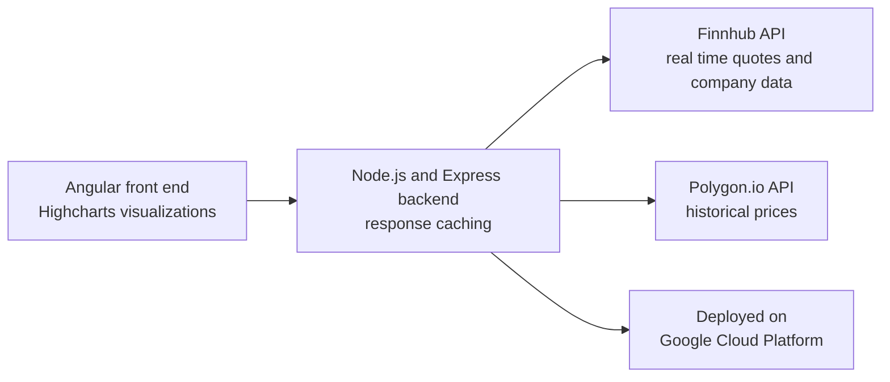

# Stock Search and Portfolio Management Platform

Full stack web platform for stock search, watchlists, and portfolio management with real time and historical market data.

## Architecture

## Features

- Real time quotes and company data from the Finnhub API, historical price charts from Polygon.io rendered with Highcharts
- Stock search with autocomplete suggestions, watchlist, and buy and sell portfolio simulation with profit and loss tracking
- Node.js and Express backend with response caching for API efficiency
- Deployed on Google Cloud Platform

## Stack

Angular · TypeScript · Node.js · Express · Highcharts · Finnhub and Polygon.io APIs · GCP
